# web_tet_ai_cong_nghe_so

#  🌸 TẾT AI 2026 - XUÂN BÍNH NGỌ 4.0 🌸

> **Web Tết AI 2026** - Nền tảng giải trí All-in-One đón Xuân Bính Ngọ: Trợ lý AI (Groq), Lì xì 4.0, Game Tết & Tạo thiệp Online.

[](https://web-tet-ai.vercel.app/)

Chào mừng đến với dự án **Web Tết AI Công Nghệ Số** - Một nền tảng giải trí tổng hợp kết hợp giữa không khí Tết cổ truyền Việt Nam và công nghệ AI hiện đại (Artificial Intelligence).

Dự án mang đến trải nghiệm đón Tết độc đáo, tiện lợi và thú vị cho người dùng trong dịp Xuân Bính Ngọ 2026.
## Chi Tiết Tính Năng

Hệ thống cung cấp 14 tính năng độc đáo được chia thành các nhóm chính, giúp người dùng trải nghiệm Tết trọn vẹn:

### 🕒 1. Đếm Ngược Giao Thừa (Countdown)
- **Đồng hồ thời gian thực:** Hiển thị chính xác số Ngày, Giờ, Phút, Giây còn lại đến thời khắc Giao Thừa Tết Bính Ngọ 2026.
- **Thông tin nghỉ Tết:** Cung cấp lịch nghỉ Tết chính thức cho Học sinh, Sinh viên và Người đi làm.
- **Hiệu ứng pháo hoa:** Tự động kích hoạt màn pháo hoa rực rỡ khi đồng hồ điểm 00:00:00.

### 📝 2. Lịch Trình Đón Tết (To-Do List)
- **Danh sách việc cần làm:** Gợi ý chi tiết các công việc truyền thống từ ngày 22 đến 29 tháng Chạp (Cúng ông Táo, Gói bánh chưng, Tảo mộ, Tất niên...).
- **Tích hợp Lịch:** Tính năng "Thêm vào lịch" giúp xuất file `.ics` để đồng bộ ngay vào Google Calendar hoặc Apple Calendar trên điện thoại.

### 🤖 3. Trợ Lý Chúc Tết AI (AI Wishes)
- **Sáng tạo nội dung:** Sử dụng AI (Gemini/Groq) để soạn lời chúc, làm thơ 4 câu hoặc viết câu đối đỏ.
- **Cá nhân hóa cao:** Tùy chọn đối tượng nhận (Ông bà, Sếp, Người yêu...), phong cách (Hài hước, Trang trọng, Tình cảm) và chủ đề (Tài lộc, Sức khỏe).

### 💰 4. Chia Lì Xì Random (Lucky Money)
- **Thuật toán công bằng:** Nhập tổng tiền và số người, hệ thống sẽ chia ngẫu nhiên các phần tiền khác nhau.
- **Vua Lì Xì:** Tự động tìm ra người may mắn nhận được số tiền lớn nhất (King).
- **Lời chúc đính kèm:** Mỗi bao lì xì đi kèm một lời chúc vui nhộn hoặc "cà khịa" hài hước.

### 🔮 5. Gieo Quẻ Đầu Năm (Fortune Telling)
- **Xem bói vui:** Nhập tuổi và giới tính để xin quẻ về Tình duyên, Sự nghiệp hoặc Tài lộc.
- **Kết quả chi tiết:** AI đóng vai thầy phán, cung cấp tên quẻ, lời bình giải thơ văn, con số may mắn và màu sắc hợp mệnh.

### 🚪 6. Xem Tuổi Xông Đất (First Footing)
- **Phân tích phong thủy:** Dựa trên năm sinh gia chủ để phân tích Thiên Can, Địa Chi, Ngũ Hành.
- **Gợi ý chính xác:** Đề xuất 3 tuổi đẹp nhất (Tam Hợp, Lục Hợp) để xông nhà, kèm lý do giải thích chi tiết.

### ❓ 7. Đoán Lì Xì (Guess Game)
- **Minigame vui vẻ:** Chọn mở bao lì xì để nhận tiền mừng tuổi ảo.
- **Chế độ Troll:** Nếu bật chế độ này, hệ thống sẽ dựa vào tuổi người chơi để đưa ra số tiền và lời nhắn "bá đạo" (Ví dụ: Lớn rồi không được lì xì, Trẻ con mới được nhiều...).

### 🎮 8. Game Hứng Lộc (Catch Lixi)
- **Cách chơi:** Di chuyển túi thần tài (bằng chuột hoặc chạm tay) để hứng các bao lì xì rơi xuống và tránh pháo nổ.
- **Thử thách:** Giới hạn thời gian 60 giây.
- **Lưu điểm:** Tự động lưu điểm số cao nhất vào Bảng Xếp Hạng (yêu cầu đăng nhập).

### 🧠 9. Đố Vui Ngày Tết (Tet Quiz)
- **Ngân hàng câu hỏi:** Hàng trăm câu hỏi trắc nghiệm về Phong tục, Ẩm thực, Lịch sử Tết.
- **Chế độ Thử thách:** Chơi tính giờ (10 câu/1 phút, 20 câu/5 phút...) để tích điểm đua Top.
- **Kiến thức bổ ích:** Hiển thị giải thích chi tiết cho từng đáp án đúng/sai.

### 🏃 10. Tập Thể Dục (Exercise)
- **Giữ dáng ngày Tết:** Công cụ bấm giờ tập luyện với các mốc 10, 20, 30 phút.
- **Nhạc nền động lực:** Tự động chuyển từ nhạc Tết sang nhạc tập thể dục sôi động (EDM/Vinahouse) khi bắt đầu tập.

### 🎨 11. Tạo Ảnh Tết AI (Prompt Engineering)
- **Hỗ trợ sáng tạo:** Giúp người dùng không rành tiếng Anh viết câu lệnh (Prompt) chuẩn xác để tạo ảnh trên Midjourney, DALL-E 3.
- **Tùy chỉnh chi tiết:** Lựa chọn phong cách (3D, Anime, Sơn dầu...), ánh sáng, góc máy và tỷ lệ khung hình.

### 💌 12. Thiệp Tết Online (Card Creator)
- **Thiết kế thiệp:** Tải ảnh cá nhân lên, chọn khung hình Tết (Hoa đào, Khung vàng...).
- **Chèn lời chúc:** Viết lời chúc lên thiệp, tùy chỉnh phông chữ thư pháp, màu sắc và kích thước.
- **Tải về:** Xuất file ảnh chất lượng cao để gửi tặng bạn bè qua mạng xã hội.

### 🔄 13. Lì Xì Chéo (Exchange Challenge)
- **Ghép đôi ngẫu nhiên:** Nhập danh sách tên nhóm bạn/đồng nghiệp, hệ thống sẽ quay số để ghép cặp "Người tặng - Người nhận".
- **Thử thách đi kèm:** Có tùy chọn thêm các thử thách vui (Hát, múa, uống bia...) kèm theo lì xì.

### 💳 14. Tạo Mã VietQR (QR Code)
- **Chuyển khoản nhanh:** Tạo mã QR chuyển khoản cho hơn 50 ngân hàng tại Việt Nam.
- **Nội dung AI:** Sử dụng AI để gợi ý nội dung chuyển khoản lì xì độc đáo, hài hước.

### 👤 15. Hệ thống Tài khoản & Bảng Xếp Hạng (User System)
- **Đăng nhập đa dạng:**
  - **Google:** Đăng nhập nhanh chóng, bảo mật.
- **Hồ sơ cá nhân:** Thống kê chi tiết (Gieo quẻ, Lì xì, Game...), danh hiệu vui nhộn và tính năng **Xóa dữ liệu thống kê**.
- **Bảng vàng thành tích:** Lưu trữ điểm số minigame và so tài với người chơi khác trên bảng xếp hạng thời gian thực.

### 🕵️ 16. Tài Khoản Khách (Guest Mode)
- **Cấp tài khoản nhanh:** Hệ thống tự động tạo Username và Password ngẫu nhiên (không cần email).
- **Bảo mật 30 phút:** Mật khẩu chỉ có hiệu lực trong 30 phút.
- **Tự động đổi mật khẩu:** Nếu đăng nhập bằng mật khẩu cũ sau 30 phút, hệ thống sẽ tự động cấp mật khẩu mới và thông báo cho người dùng.

## Công Nghệ Sử Dụng

- **Frontend:** HTML5, CSS3 (Glassmorphism UI), Vanilla JavaScript.
- **Backend/Database:** Firebase (Authentication, Firestore) để lưu trữ điểm số và người dùng.
- **AI API:** Tích hợp API của Groq (Llama 3) để xử lý ngôn ngữ tự nhiên.
- **Hiệu ứng:** HTML5 Canvas (Pháo hoa, Game hứng lộc, Thiệp Tết), CSS Animations.

## 📦 Cài Đặt & Sử Dụng

1. **Clone dự án:**
   ```bash
   git clone https://github.com/trietpko2002/web_tet_ai_cong_nghe_so.git
   ```

2. **Cấu hình Firebase & API:**
   - Mở file `script.js` bằng trình soạn thảo code (như VS Code).
   - **Cấu hình Firebase (Bắt buộc để lưu điểm, tài khoản):**
     - Tìm đến biến `firebaseConfig`.
     - Thay thế các giá trị mẫu (`API_KEY_HERE`, `ID_CUA_BAN`...) bằng thông tin từ dự án Firebase của bạn.
     - *Nếu bạn chưa có, hãy tạo một dự án mới trên Firebase Console.*
   - **Cấu hình API cho AI (Bắt buộc cho các tính năng AI):**
     - Dự án này sử dụng API của **Groq** (miễn phí, nhanh) làm mặc định.
     - **Bước 1: Lấy API Key (Miễn phí)**
       1. Truy cập GroqCloud Console.
       2. Đăng nhập bằng tài khoản Google/GitHub/Email.
       3. Tại menu bên trái, chọn mục **API Keys**.
       4. Nhấn nút **Create API Key**.
       5. Đặt tên bất kỳ (VD: `TetApp`) rồi nhấn **Submit**.
       6. **QUAN TRỌNG:** Copy ngay chuỗi ký tự bắt đầu bằng `gsk_...` (Vì nó chỉ hiện 1 lần duy nhất).
     - **Bước 2: Dán vào code**
       - Trong file `script.js`, tìm đến dòng:
         ```javascript
         const API_KEY = "API_KEY".trim(); // <-- Dán Key Groq (gsk_...) vào đây
         ```
       - Thay thế `"API_KEY"` bằng API Key bạn vừa copy.
       - **Ví dụ:** `const API_KEY = "gsk_abc123xyz...".trim();`

3. **Chạy ứng dụng:**
   - Mở file `index.html` trên trình duyệt web bất kỳ.
   - Hoặc sử dụng Live Server trên VS Code để có trải nghiệm tốt nhất.

## 🌐 Hướng Dẫn Triển Khai (Deploy)
 
Dự án này tối ưu để triển khai lên **Vercel**.
Dự án này là Static Web (HTML/CSS/JS) nên rất dễ dàng triển khai miễn phí.
 
### Hướng dẫn nhanh:
1. Push code lên GitHub.
2. Vào Vercel, chọn **Add New Project**.
3. Import repo vừa tạo.
4. Nhấn **Deploy** (Vercel tự động nhận diện đây là static site).
### Cách 1: Deploy lên Vercel (Khuyên dùng)
Vercel tốc độ cao, hỗ trợ CI/CD tự động (cập nhật web ngay khi bạn push code lên GitHub).
 
1. **Đẩy code lên GitHub:**
   - Tạo một repository mới trên GitHub.
   - Upload toàn bộ code của bạn lên đó.
2. **Đăng ký/Đăng nhập Vercel:**
   - Truy cập Vercel.com.
   - Đăng nhập bằng tài khoản GitHub.
3. **Tạo Project mới:**
   - Tại Dashboard, nhấn nút **"Add New..."** -> **"Project"**.
   - Ở mục **Import Git Repository**, tìm repo bạn vừa tạo và nhấn **Import**.
4. **Cấu hình & Deploy:**
   - **Framework Preset:** Chọn *Other* (hoặc để mặc định vì đây là HTML thuần).
   - **Root Directory:** Để `./` (mặc định).
   - Nhấn **Deploy**.
   - Chờ khoảng 1 phút, Vercel sẽ cung cấp cho bạn đường link (VD: `web-tet-ai.vercel.app`).

### Cách 2: Deploy lên GitHub Pages
Đơn giản, tích hợp sẵn trong GitHub.

1. **Vào Repository của bạn trên GitHub.**
2. Chọn tab **Settings** (Cài đặt).
3. Ở menu bên trái, chọn mục **Pages**.
4. Tại phần **Build and deployment**:
   - **Source:** Chọn `Deploy from a branch`.
   - **Branch:** Chọn `main` (hoặc `master`) và folder `/ (root)`.
5. Nhấn **Save**.
6. Chờ khoảng 1-2 phút, refresh lại trang, bạn sẽ thấy link web hiện ra ở trên cùng (VD: `username.github.io/repo-name`).

## ⚠️ Lưu Ý Quan Trọng (Disclaimer)

Ứng dụng **Web Tết AI 2026** được phát triển với mục đích **GIẢI TRÍ THUẦN TÚY** nhân dịp Tết Nguyên Đán.

- 🚫 **Nghiêm cấm** sử dụng các tính năng (Lì xì, Gieo quẻ, Game...) vào mục đích **cá cược, đánh bạc, lô đề** hoặc các hành vi vi phạm pháp luật Việt Nam.
- 🤖 Các nội dung do AI tạo ra (Lời chúc, Quẻ bói) chỉ mang tính chất tham khảo vui vẻ.
- ⚖️ Tác giả không chịu trách nhiệm về việc người dùng sử dụng sai mục đích của ứng dụng.
## 📸 Ảnh Demo

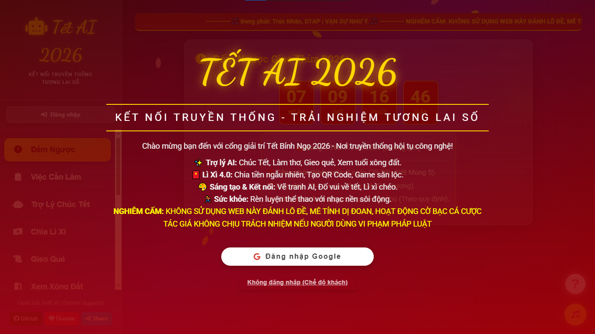

<table>
  <tr>
    <td align="center">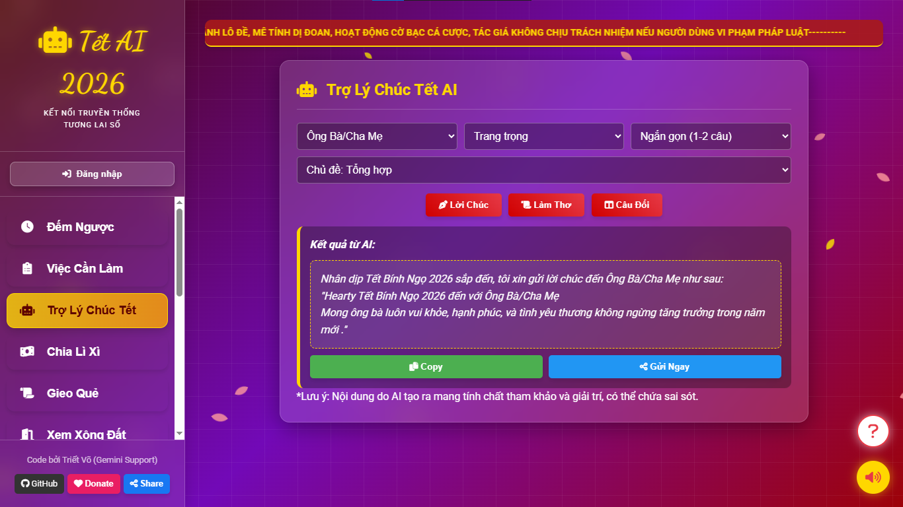<br /><b>1. Đếm Ngược Giao Thừa</b></td>
    <td align="center">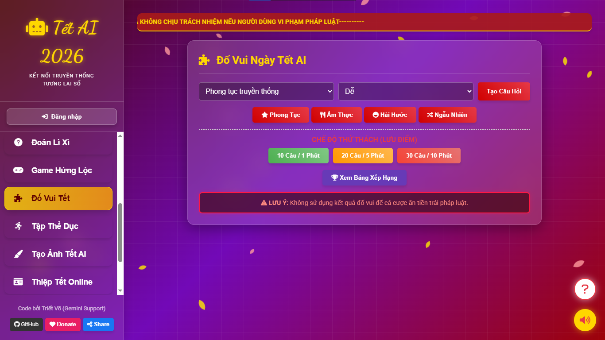<br /><b>2. Lịch Trình Đón Tết</b></td>
    <td align="center">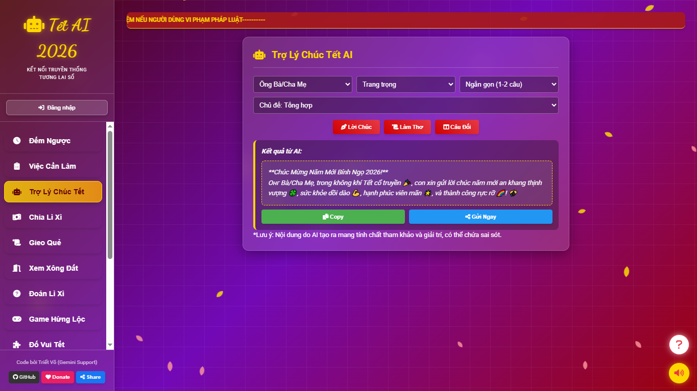<br /><b>3. Trợ Lý Chúc Tết AI</b></td>
  </tr>
  <tr>
    <td align="center">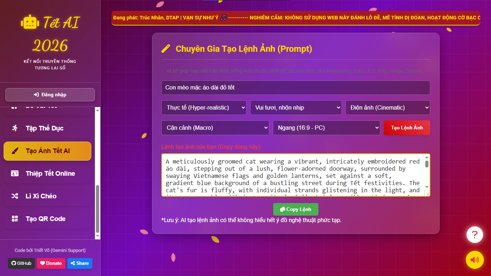<br /><b>4. Chia Lì Xì Random</b></td>
    <td align="center">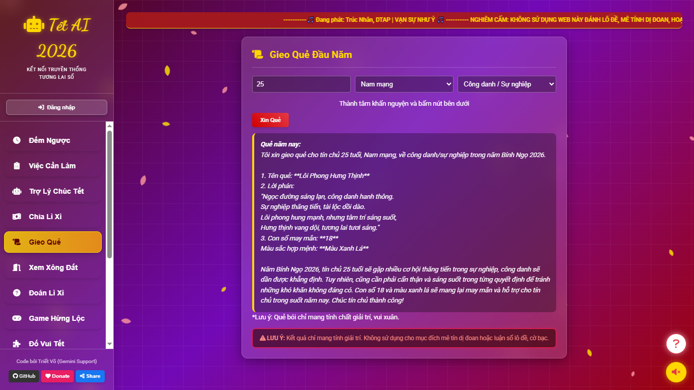<br /><b>5. Gieo Quẻ Đầu Năm</b></td>
    <td align="center">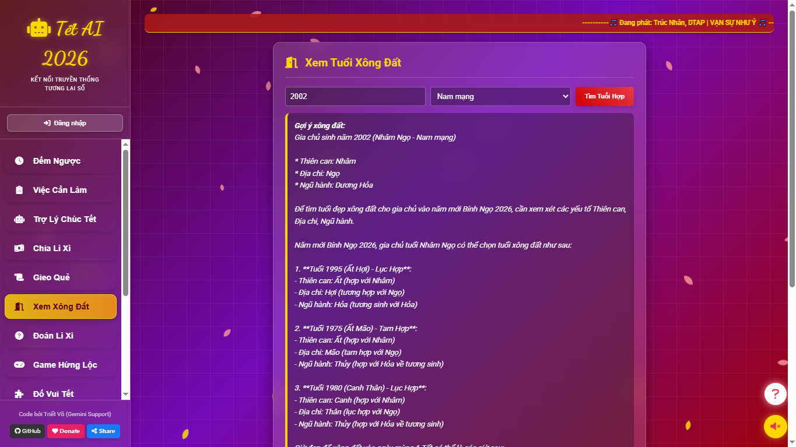<br /><b>6. Xem Tuổi Xông Đất</b></td>
  </tr>
  <tr>
    <td align="center">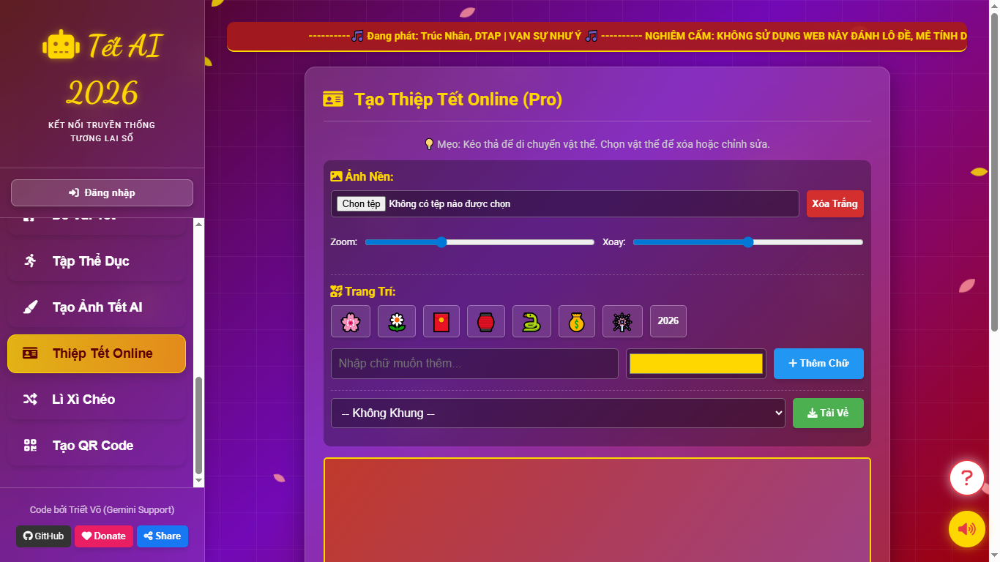<br /><b>7. Đoán Lì Xì (Troll)</b></td>
    <td align="center">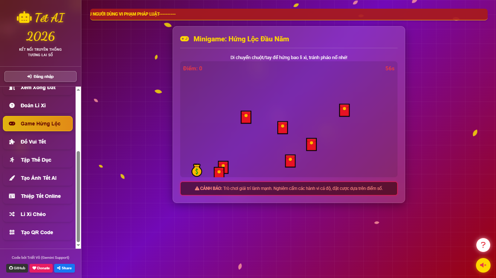<br /><b>8. Game Hứng Lộc</b></td>
    <td align="center">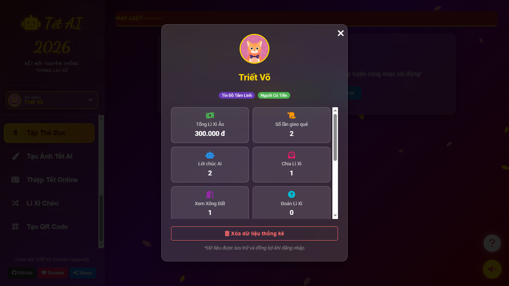<br /><b>9. Đố Vui Ngày Tết</b></td>
  </tr>
  <tr>
    <td align="center">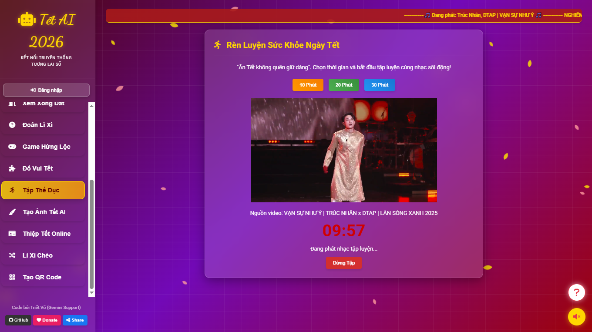<br /><b>10. Tập Thể Dục</b></td>
    <td align="center">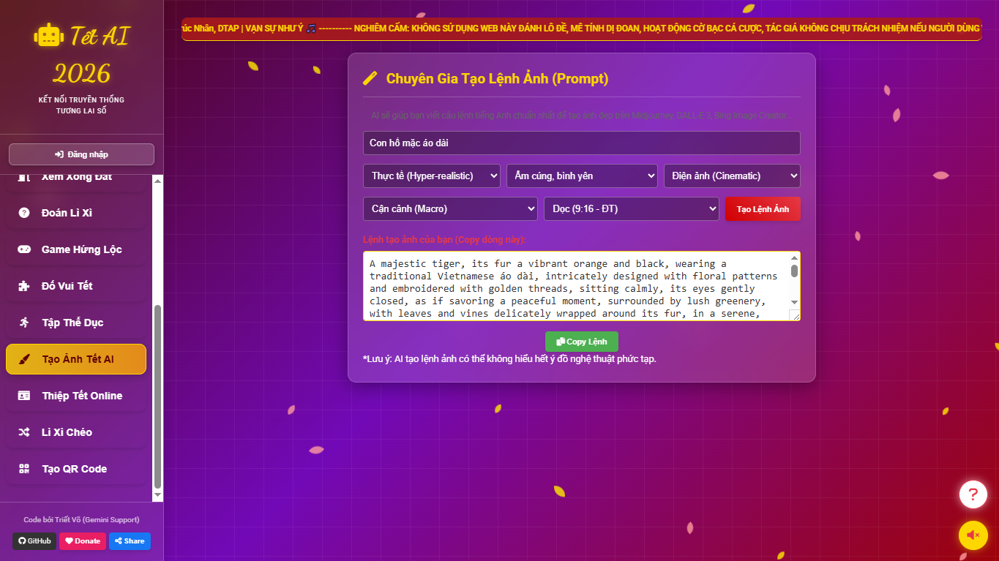<br /><b>11. Tạo Ảnh Tết AI</b></td>
    <td align="center">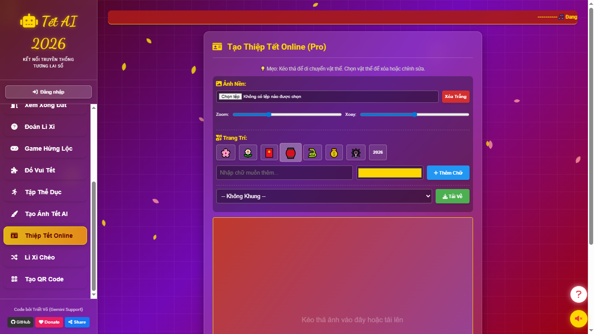<br /><b>12. Thiệp Tết Online</b></td>
  </tr>
  <tr>
    <td align="center">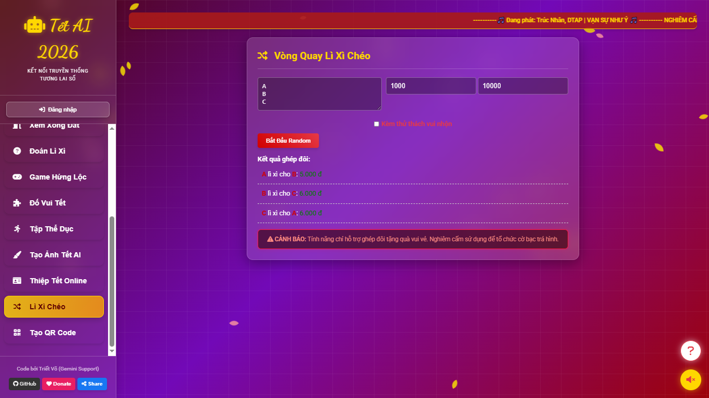<br /><b>13. Lì Xì Chéo</b></td>
    <td align="center">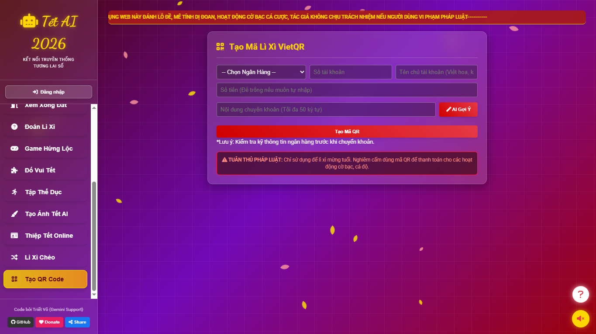<br /><b>14. Tạo Mã VietQR</b></td>
    <td align="center">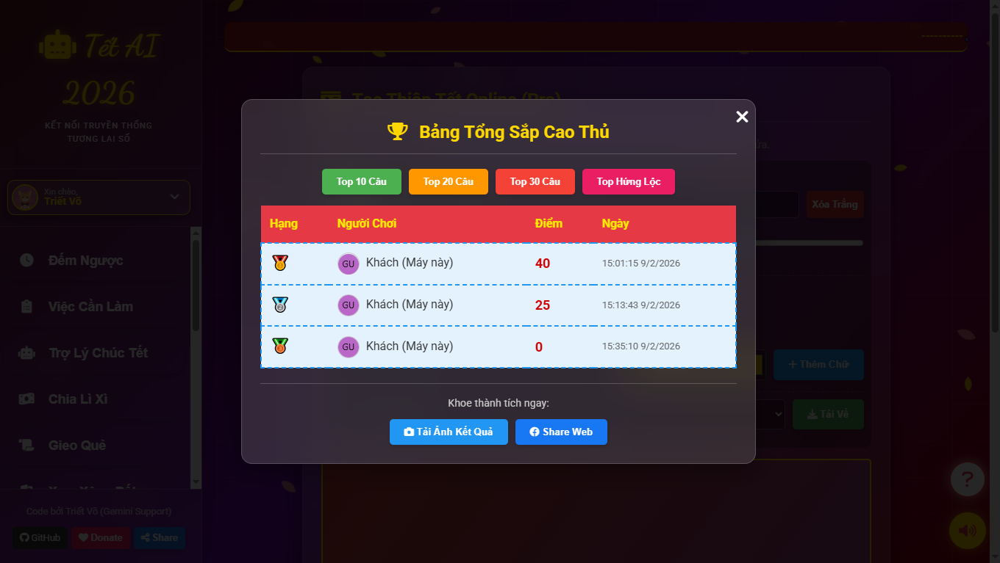<br /><b>15. Bảng Xếp Hạng</b></td>
  </tr>
</table>

## 🤝 Đóng Góp

Mọi ý kiến đóng góp hoặc báo lỗi xin vui lòng gửi Pull Request hoặc tạo Issue trên GitHub.
Hoặc thông qua email: phanranggaming@gmail.com
---
**Chúc Mừng Năm Mới - An Khang Thịnh Vượng!** 🎉
